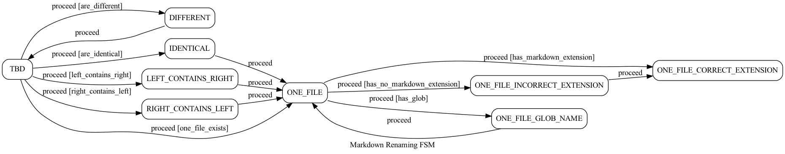

# Obsidian Sanitizer

Obsidian Sanitizer is a utility to clear clutter in obsidian markdown files.

Over the usage of [Obsidian](https://obsidian.md) on different devices I have noticed that there are often duplicate files, de-synchronized notes and strange recursive folders. This utility is aiming at fixing the clutter, and is a collection of fixes for various issues I have encountered.

## Usage

```shell
main.py --source <OBSIDIAN_FOLDER> --glob <GLOB> --log <WARN|INFO|DEBUG>
```

## Examples

```shell
main.py --glob *_SM-G998U1_* --source "/Users/tyemirov/obsidian copy.md" --log err
```

## File comparison

The project uses [vimdiff](https://linux.die.net/man/1/vimdiff#:~:text=Vimdiff%20starts%20Vim%20on%20two,for%20details%20about%20Vim%20itself.) for file comparison. Vim familiarity is expected

**shortcomings**: 3-way merge is not supported. Use direct editing with _y_ to yank the lines, _p_ to paste and `Ctrl+w+w` to switch between panes

### Useful vimdiff shortcuts

| Shortcut          | Action                                                    |
|-------------------|-----------------------------------------------------------|
| `]c`              | jump to the next change                                   |
| `[c`              | jump to the previous change                               |
| `do`              | get changes from other window into the current window     |
| `dp`              | put the changes from current window into the other window |
| `:xa`             | save all changes and close Vim                            |
| `:diffupdate`     | refresh the changes in both panes                         |
| `:windo set wrap` | set wrapped lines in both screens                         |
| `Ctrl+w+w`        | switch between the panes                                  |

## Actions

1. Removes Mac system files e.g. .DS_Store
1. Removes empty filee
1. Removes empty Folders
1. Renames folders that have markdown extension
1. Renames folders that match the provided glog pattern
1. move_folders(glob) \
1. Renames markdown files with no extension
1. Renames markdown files that match the provided glog pattern
1. move_to_resources_folder(resource_folder)

## Finite State Machine



## Help needed

1. Tests are dismal. Any improvements are welcome
2. Documentation is lacking. Any improvements are welcome
3. Extra features
   1. Find duplicate files regardless of their location
   2. Deflate a folder: recursively move all files in subdir to the dir and remove subdirs
   3. Add an ability to prepend YAML templates to markdown files
